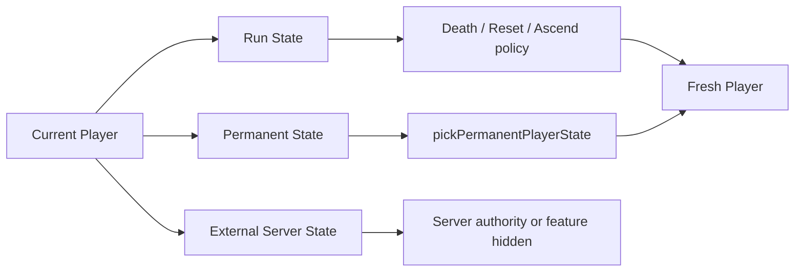
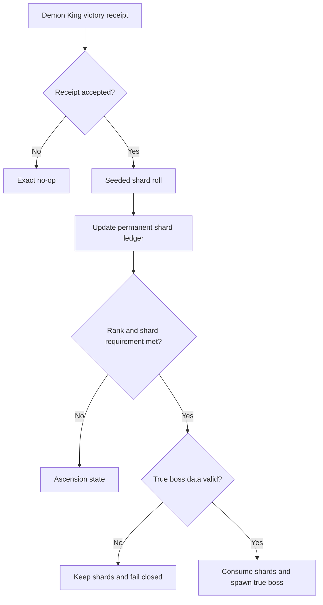

# Aetheria Release-Complete Core Design

Date: 2026-08-11 KST

Status: Approved by user; repository-owned implementation and automated gates verified;
candidate commit and observation-dependent depth remain pending

Planning model: GPT-5.6 Sol xhigh

Implementation preference: GPT-5.6 Luna max when callable; otherwise an explicitly disclosed Sol/Terra fallback

## Goal

Aetheria의 Apps in Toss 후속 절차를 hold한 상태에서 다음 플레이 여정을 release-complete core로 완성한다.

`신규 시작 → 첫 원정 → 성장·장비 → 전직 → 중후반 지역·보스 → 마왕 → 진보스 → prestige → New Game+ 재개`

완성은 기능 수가 아니라 다음 세 조건으로 판정한다.

1. 정상 플레이로 모든 필수 구간에 도달할 수 있다.
2. 사망, 수동 reset, prestige, save/reload 뒤에도 영구 진행이 정확히 보존된다.
3. 모든 player-facing 기능은 실제 권한과 결과가 있으며, 미완성 external 기능은 노출하지 않는다.

Release-complete core가 닫힌 뒤에만 기존 52개 지역, 254종 몬스터, 143개 퀘스트를 재사용한 bounded encounter depth를 확장한다. Toss 검토, 공개, 광고 활성화는 이 설계의 재개 gate 전까지 실행하지 않는다.

## Live Findings That Drive This Design

### P0: the natural true-ending route is unreachable

`handleDemonKingSlain`은 원시의 파편을 run inventory에 넣는다. 같은 run에서는 마왕 재등장이 차단되고, 다음 run을 만드는 `ASCEND`, `RESET_GAME`, 사망 경로는 inventory를 초기화한다. 마지막 파편이 drop된 경우에도 함수가 dispatch 이전 `updatedPlayer.inv`를 다시 읽기 때문에 즉시 진보스가 열리지 않는다.

결과적으로 player-facing 안내와 달리 정상적인 `마왕 처치 → 승천 → 다음 회차` 반복으로 파편을 누적할 수 없다.

Current-byte read-only reproduction: rank 3, shard 2, guaranteed drop 상태에서 handler는 shard count를 3으로 만든 뒤에도 true boss를 생성하지 않고 Ascension으로 이동했다. 이어서 `ASCEND`를 적용하면 shard count는 0이 됐다.

### P1: permanent state is governed by drifting manual allowlists

`RESET_GAME`, `ASCEND`, defeat reset이 각각 영구 필드를 수동으로 복사한다. 현재 `classJourney`, `readabilityMode`, `equipmentDetailMode`가 누락되어 직업 여정과 accessibility preference가 사망 또는 prestige 뒤 사라진다.

개별 필드를 세 군데에 추가하는 hotfix는 같은 종류의 회귀를 다시 만든다. 영구 상태를 고르는 단일 pure authority가 필요하다.

Current-byte read-only reproduction: 동일 player fixture에 `classJourney`와 `settings: high/full`을 넣고 death, `RESET_GAME`, `ASCEND`를 각각 실행했을 때 세 결과 모두 `classJourney: null`, `settings: standard/auto`였다.

### P1: public grave invasion is not server-authoritative

다른 모험가의 유해는 client에서 읽고 RNG를 실행한 뒤 local reducer가 보상을 추가한다. target grave를 Firestore transaction으로 consume하거나 claimant receipt를 고정하지 않는다. 자기 유해 필터도 top-level UID 대신 player field를 읽는다.

동시 접근, reload, 다른 client에서 동일 보상을 다시 획득할 수 있으므로 release-complete core에는 포함할 수 없다. 자신의 유해 회수는 local authoritative flow이므로 유지한다.

### P1: true-ending mobile closure is unproven

True Ending은 실제 UI E2E가 없고, 강제 대기, 작은 typography, skip/reduced-motion 부재, 좁은 화면 overflow가 검증되지 않았다. Endgame reachability를 고쳐도 마지막 화면이 모바일에서 막히면 player journey는 완료되지 않는다.

Current-byte source audit: New Game+ CTA는 five narrative timers 뒤 earliest 10.8 seconds에 나타난다. 현재 tests는 두 `data-testid` 문자열 존재만 검사하며 실제 render, timer, click, viewport, back 또는 reload를 실행하지 않는다. CTA와 보조문구는 10px이고 screen owner에는 scroll region이나 skip action이 없다.

### P2: copy and dead plumbing obscure real outcomes

- reset copy가 영구 진행 보존 여부를 정확히 설명하지 않는다.
- shard probability 안내와 production constant가 일치하지 않는다.
- `inventorySpotlight` 전달 경로는 실제 owner에서 항상 null이다.
- `archivedHistory`에는 production writer가 없다.

이 항목은 behavior lock 뒤 연결하거나 제거한다. 새로운 기능으로 확장하지 않는다.

## Product Boundary

### Included

- fresh start부터 first prestige와 다음 회차 재개까지의 모든 필수 transition
- rank 3 + 마지막 shard checkpoint에서 진보스와 True Ending까지의 실제 endgame route
- death, manual reset, ascend, save/reload permanent-state matrix
- own-grave recovery
- accessibility settings와 class journey의 영구 보존
- True Ending과 New Game+의 390x844 mobile closure
- 기존 지역과 몬스터를 재사용하는 bounded encounter pack

### Verified by simulation and representative checkpoints

- 전체 prestige rank ladder
- Abyss 장기 milestone
- 18-job late-game combat spread
- Lv2, 5, 10, 20, 45, 60, 75 progression checkpoints

이 영역은 모든 상태 조합을 실제 플레이로 소진하지 않는다. deterministic simulator와 production-valid 대표 checkpoint로 correctness를 증명한다.

### Excluded until a separate design is approved

- Toss review, public release, ad activation
- IAP와 paid service
- server transaction이 없는 public grave invasion
- 신규 통화, 신규 top-level menu, 신규 지역 대량 추가
- runtime generative AI content
- EXP, loot, event multiplier activation
- historical TODO와 placeholder의 일괄 구현

## State Authority

Player state를 세 범주로 나눈다.

### Run State

현재 시도에서만 유효하다.

- HP, MP, energy, current equipment and inventory
- active quests and expedition snapshot
- current event, enemy, combat turn and receipts
- temporary relics and run flags
- area boss defeated state

Death, manual reset, ascend reason에 맞게 초기화한다.

### Permanent State

회차가 바뀌어도 보존한다.

- `meta` progression and mirror
- titles, active title, premium-owned local assets
- class journey and representative expedition history
- readability and equipment disclosure settings
- codex, claim ledgers, lifetime stats and pity
- expedition sequence and return-supply reward receipts
- canonical endgame shard ledger and endgame receipts

`pickPermanentPlayerState(previousPlayer)`가 이 목록의 단일 source of truth가 된다. Death, manual reset, ascend는 이 picker를 공유하고 각 transition이 의도적으로 다르게 처리하는 name, job, starter loadout만 별도 policy로 둔다.

### External Server State

다른 사용자 또는 provider가 authority인 상태다.

- public grave claim
- rewarded-ad/provider receipts
- cloud identity and production analytics authority

Local client가 단독으로 발행하거나 중복 제거할 수 없는 기능은 production capability flag가 기본 false다.



## Endgame Transaction Architecture

Endgame settlement는 hook-level multi-dispatch가 아니라 reducer-owned atomic transaction으로 처리한다.

권장 interface:

```ts
type ResolveDemonKingOutcomePayload = {
  expectedCombatTurn: number;
  combatReceiptKey: string;
  seed: number;
  now: number;
};
```

Reducer는 최신 state에서 다음을 한 번에 수행한다.

1. combat turn과 receipt replay를 검증한다.
2. prestige rank와 permanent shard count를 읽는다.
3. seeded shard roll을 수행한다.
4. shard ledger를 증가시킨다.
5. 증가된 count로 진보스 unlock을 판정한다.
6. 진보스 데이터가 유효하면 필요한 shard를 소비하고 enemy/game state를 설정한다.
7. unlock되지 않으면 Ascension으로 전환한다.
8. logs, sync status, receipts를 같은 state result에 확정한다.

진보스 데이터가 없거나 malformed이면 shard를 소비하지 않고 fail closed한다. 같은 receipt replay는 object-equivalent no-op이어야 한다.

원시의 파편은 inventory item이 아니라 permanent meta ledger가 authority다. Legacy inventory 파편은 additive migration에서 한 번만 canonical count로 이관하고 inventory에서 제거한다. Migration은 idempotent하며 malformed/negative/excessive counts를 bounded integer로 normalize한다.



## Public Grave Containment

Own-grave recovery remains available. The `다른 모험가` tab, remote fetch, and invade action are hidden behind a production capability whose default is false.

Current-byte E2E explicitly clicks `grave-view-public` and accepts an offline/loading message, so the unsafe capability is intentionally player-visible today. No existing feature flag or environment gate encloses the remote fetch and local reward dispatch.

The capability may be enabled only after a separate server-authoritative design supplies all of the following:

- authenticated claimant identity
- target grave version or claim ID
- Firestore/server transaction that consumes the target reward
- server-side reward roll or immutable reward receipt
- replay-safe claimant receipt
- concurrent claimant test
- privacy and abuse review

The existing client-only path is not labeled beta or left visible but disabled. An unavailable experience is not a release feature.

## True Ending and New Game+ UX

True Ending must not trap the player behind animation or small-screen geometry.

- an immediate visible skip action
- reduced-motion path with no artificial wait
- vertical scrolling inside the screen owner
- safe-area top and bottom consumption
- minimum 44px primary/skip actions
- readable semantic typography, no essential 10px copy
- back action that follows the screen's explicit policy rather than closing the app
- deterministic New Game+ action with one accepted transition
- reload after True Ending and after New Game+ without duplicate rewards or restored consumed shards

Reset copy distinguishes what is reset from what is preserved. The action is named in player vocabulary, for example `현재 여정 다시 시작`, and lists run loss versus permanent preservation before confirmation.

## Delivery Slices

### Slice 0: scope freeze and completion contract

Deliverables:

- this design and the subsequent implementation plan
- task ledger marks Toss as hold, not failed or complete
- requirement matrix for fresh, midgame, endgame, prestige and content depth
- old `.ait` and deployment evidence labeled superseded after the first source change

No production behavior changes in this slice.

### Slice 1: permanent progress authority

Likely files:

- `src/types/player.ts`
- `src/utils/dataMigration.ts`
- new `src/utils/permanentProgress.ts`
- `src/reducers/handlers/progressionHandlers.ts`
- defeat settlement owner in `src/systems/*`
- focused permanent-state tests

Acceptance:

- death, reset and ascend preserve byte-equivalent class journey and settings
- all current permanent ledgers remain preserved
- run-bound equipment, inventory, active expedition and combat flags reset
- expedition replay does not increment class journey
- malformed legacy values normalize safely
- `save → reload → transition → reload` is stable for all three transitions

### Slice 2: atomic endgame journey

Likely files:

- `src/hooks/combatActions/combatVictory.ts`
- `src/hooks/combatActions/combatBossHandlers.ts`
- `src/reducers/handlers/combatHandlers.ts` or new endgame handler
- `src/reducers/actionTypes.ts`
- `src/types/player.ts`
- `src/utils/dataMigration.ts`
- endgame transaction tests

Acceptance:

- shard 0/1/2 and drop/no-drop combinations are deterministic
- rank 3 with two shards plus final drop spawns the true boss in the same transaction
- ascend, death, reset and reload preserve shard count
- legacy inventory migration runs exactly once
- duplicate reducer action and callback replay produce exact no-op
- missing true-boss data does not consume shards
- true-boss defeat reaches True Ending once
- New Game+ consumes no reward twice and preserves permanent history

### Slice 3: unsafe surface containment and mobile closure

Likely files:

- `src/components/GravePanel.tsx`
- runtime capability adapter or config
- `src/components/TrueEndingScreen.tsx`
- reset/ascension confirmation owners
- lifecycle/back integration tests
- mobile E2E

Acceptance:

- public grave network call and action are unreachable with default production capability
- own-grave recovery remains unchanged
- true ending works at 375x667, 390x844 and 430x932
- skip, reduced motion, back, foreground/background and reload behave deterministically
- all essential actions meet touch and typography floors
- reset confirmation accurately lists preserved and reset state

### Slice 4: full journey real-surface proof

Use three production-valid routes rather than one fixture that fabricates completion.

1. Fresh route: create → first move → explore → combat → safe return → equipment decision → level 5 job change.
2. Midgame route: production-derived checkpoint → skill branch → regional boss → Demon King → ascension cancel and confirm.
3. Endgame route: rank 3 with two migrated or earned shards → Demon King UI action → true boss → True Ending → New Game+ → reload.

The checkpoint builder may accelerate setup but the transition under test must run through the real UI and production action/reducer authority.

Acceptance:

- UI state matches `render_game_to_text`
- no overflow at all three mobile viewports
- platform back closes the nearest reversible surface
- background/foreground and forced relaunch restore the last accepted state
- no duplicate class journey, shard, reward or boss receipt
- first prestige and next run are playable without test-only state remaining

### Slice 5: bounded encounter depth

Starts only after Slices 1–4 pass.

- Use the five fresh-session observations required by Slice 4 as the selection authority. Count accepted explore/combat actions by region, sort by count descending and then Unicode region name, and select the first two. If fewer than two regions have accepted actions, collect more observations instead of guessing. Production analytics may supersede the selection in a later separately reviewed release.
- Add two encounter families per region.
- Each family may vary by class lineage, HP band, discovered signature and previous boss record.
- Every choice reads as `situation → choice → expected trade-off → result`.
- No new currency, menu, region or runtime AI.
- Keep global event occurrence rate unchanged; replace or branch existing eligible outcomes rather than increasing probability.

Acceptance:

- fixed seed produces identical eligibility and outcome
- every displayed choice has a distinct state result
- no impossible cost, negative currency, negative HP or inventory overflow
- save/reload preserves event-chain progress
- encounter replay does not duplicate class journey or discovery history
- event-rate characterization remains byte-equivalent outside the selected branches
- mobile choice and result screens are visually inspected

## Test Strategy

Every slice follows:

`RED → GREEN → focused integration → full gate → real surface → independent review`

### Focused contract matrix

- permanent field preserve/reset table for death/reset/ascend
- legacy migration idempotency
- endgame seeded vectors and replay keys
- true-boss missing-data rollback
- public-grave capability false/true boundary without network calls in false mode
- True Ending animation, skip, reduced motion, back and reload
- encounter eligibility, cost and replay

### Repository gates

- `npm run verify`
- `npm run verify:full`
- `npm run art:verify`
- `npm run mobile:doctor`
- `npm run cap:sync`
- `npm run android:debug`
- `npm run ios:build:device`
- `git diff --check`

### Real-surface evidence

- desktop browser route
- 375x667, 390x844 and 430x932 browser-mobile routes
- iOS and Android background/foreground and reload
- physical iOS and Android fresh route when devices are available
- representative endgame/prestige route on both native platforms
- minimum five observed fresh sessions before Toss work resumes

Environment blockers are reported separately. A missing physical device or signing identity does not turn a local check into native acceptance.

## Completion Gate

Release-complete core is achieved only when every row below has direct evidence.

| Requirement | Required evidence |
| --- | --- |
| Natural endgame reachability | Seeded transaction tests plus real UI endgame route |
| Permanent progress safety | Death/reset/ascend/reload matrix |
| First prestige continuity | Prestige confirm, New Game+ start and reload proof |
| Mobile closure | Three viewport E2E and native screenshots |
| External feature safety | Public grave hidden or separately server-authoritative |
| Existing core regression | Full verify, art, mobile and native package gates |
| Content depth | Deterministic encounter tests and real mobile choices |
| Player observation | Five fresh sessions, P0 zero, blocking P1 zero |

The full prestige ladder is not claimed from one happy-path run. It requires deterministic simulator coverage, 18-job representative checkpoints, zero invalid numeric or truncated runs, and selected real checkpoints.

## Rollback and Recovery

- Permanent-state migration is additive.
- Legacy inventory shards are dual-read for one migration version and meta-only written afterward.
- A migration marker prevents double import.
- The endgame transaction changes no EXP, loot or event multiplier.
- Public grave is default-off rather than deleted, enabling a clean later server-authoritative implementation.
- Encounter packs are data-flagged and independently removable.
- Each slice is a cohesive review boundary; do not combine persistence/endgame fixes with encounter balance.
- Existing Apps in Toss app registration remains historical. Any source change invalidates the old candidate SHA, `.ait`, deployment evidence and observation eligibility.

## Toss Resume Gate

Apps in Toss work may resume only after:

1. natural True Ending and New Game+ reachability is proven;
2. death/reset/ascend/reload permanent matrix is green;
3. public grave is hidden or server-authoritative;
4. browser, mobile and native repository gates pass;
5. five observed fresh sessions have P0 zero and blocking P1 zero;
6. endgame/prestige device route passes;
7. a new clean Git SHA, `.ait` and release evidence candidate are created.

Review request, public release and ad activation remain separate explicit approvals after this gate.

## Model and Ownership Policy

- Sol xhigh owns architecture, migration/endgame risk review and final independent audit.
- Luna max is the requested single implementation owner when the runtime exposes it.
- If Luna is unavailable, the fallback model is stated before edits; Terra max handles bounded mechanical work and Sol high/max handles high-risk logic.
- Terra max may generate fixtures, manifests and evidence only after contracts are fixed.
- One implementation owner edits a file group at a time. Parallel reviewers remain read-only.

## Rejected Alternatives

### Field-by-field hotfix

Adding `classJourney`, settings and shards to several existing allowlists is smaller but preserves the root cause. It is rejected because future permanent fields would continue to drift.

### Content-first expansion

Adding encounter depth before fixing endgame and persistence would make an incomplete journey larger without making it completable. It is rejected.

### Client-only public grave hardening

Adding more local dedupe keys cannot prevent concurrent clients from claiming the same remote reward. It is rejected until server authority exists.

## Spec Self-Review Checklist

- No TBD or placeholder requirements.
- Run, permanent and external state boundaries are explicit.
- First prestige and full prestige ladder use different proof levels.
- Migration, replay, failure and rollback behavior are specified.
- Player-facing and native verification are required, not inferred from unit tests.
- Apps in Toss actions remain held behind an explicit resume gate.
